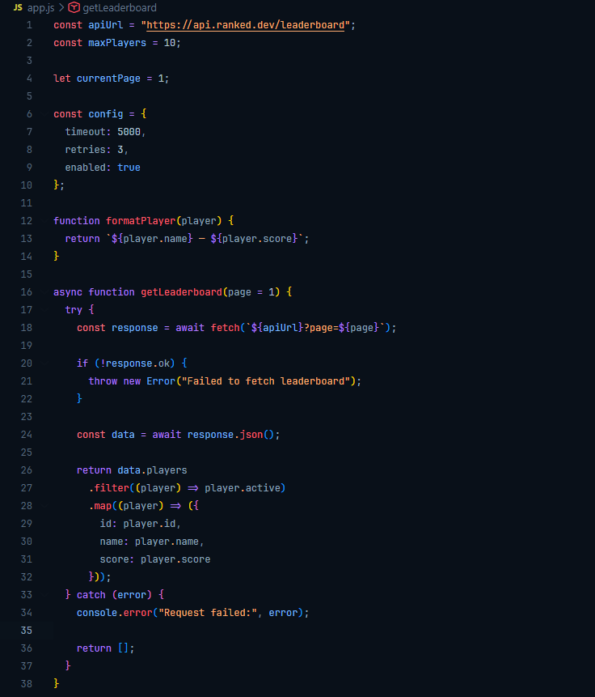
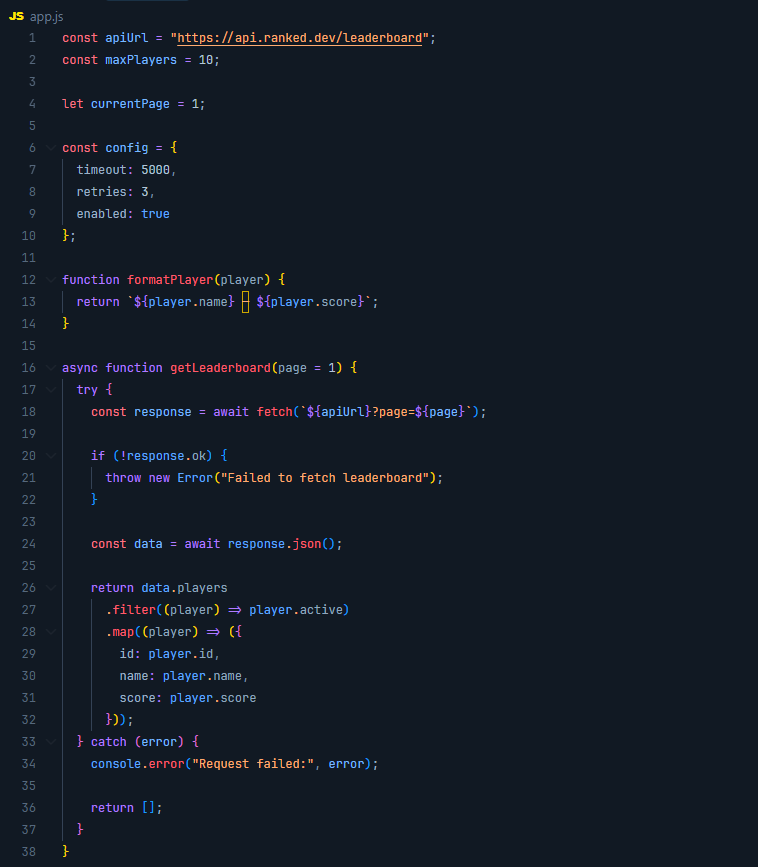
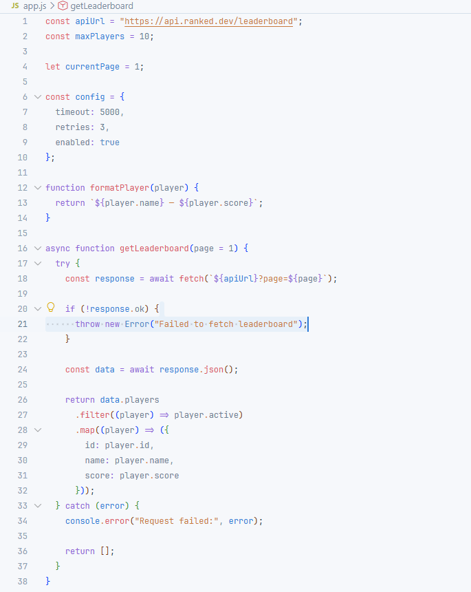

  

<h1 align="center">Ranked Theme</h1>

  A minimal theme for VS Code with strong syntax colors, available in dark, dark soft and light variants.

 

  

<h2 align="center">Dark</h2>

 

  

<h2 align="center">Dark Soft</h2>

 

  

<h2 align="center">Light</h2>

 

## Install

Search for **Ranked Theme** in the VS Code Marketplace.

Then open `Preferences: Color Theme` and choose:

- `Ranked Dark`
- `Ranked Dark Soft`
- `Ranked Light`

## License

MIT